# 프로젝트명: Rollring Rock

# [목차]

### 1. [컨셉](#1)
### 2. [관련 이미지 & 동영상](#2)
### 3. [대표 이미지](#3)
### 4. [컨셉 & 대표이미지 기반 작품묘사](#4)
### 5. [롤링 락 구성 요소](#5)
### 6. [게임 시스템 디자인](#6)
### 7. [FlowChat](#7)
### 8. [요구사항](#8)

# [컨셉] 

## 메인컨셉 :파괴

- 최종 목표인 성문이나 스테이지 내의 장애물들을 부수는 것으로 희열감을 얻을 수 있다.

### 서브 컵셉 1 :장애물

- 스피드만 빠르게 되면 자칫 루즈해질 수 있는 게임에 장애물이라는 긴장감을 주어

	플레이어로 하여금 높은 몰입감을 주기 위해 장애물을 넣는다.

### 서브 컵셉 2 :성장

- 스테이지 내에서 재화를 획득하여 플레이어의 캐릭터가 점차 성장해 가는 시스템을 주어

	스테이지가 처음에는 난이도가 높아 클리어가 어려울 지라도

	점차 성장함에 따라 난이도가 점진적으로 하향되어

	난이도에 대한 제약을 덜 받게 할 수 있다.

### 서브 컵셉 3 :전략

- 본인의 컨트롤에 따른 성장 테크트리를 구축하여 스테이지에와 본인의 실력에 따라

	원하는 전략을 구상할 수 있어 플레이어 캐릭터에 더욱 몰입할 수 있는 요소를 준다.

### 서브 컵셉 4 :스피드

- 빠른 스피드를 통해 플레이어로 하여금 몰입감과 쾌감을 선사한다.

### 서브 컵셉 5 :연속성

- 스테이지를 클리어하거나 리셋하기 전까지는 한 스테이지 내에서 플레이어가 플레이한 내용이

	다음 플레이에도 영향을 주는 연속성을 주어 다양한 전략을 낼 수 있도록 유도한다.

  

# [관련 이미지 & 동영상] 

- 이미지  
  
- 동영상
  [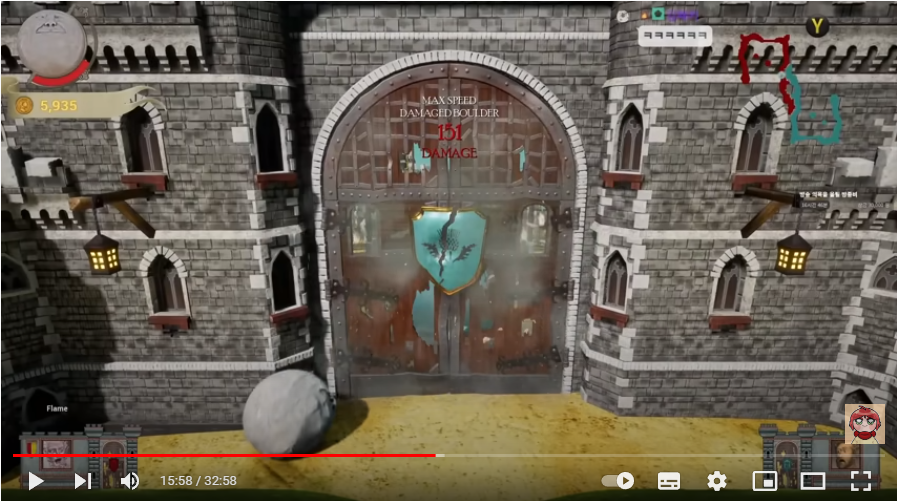](https://www.youtube.com/watch?v=uZyJKFHiTP4)

  

# [대표 이미지] 

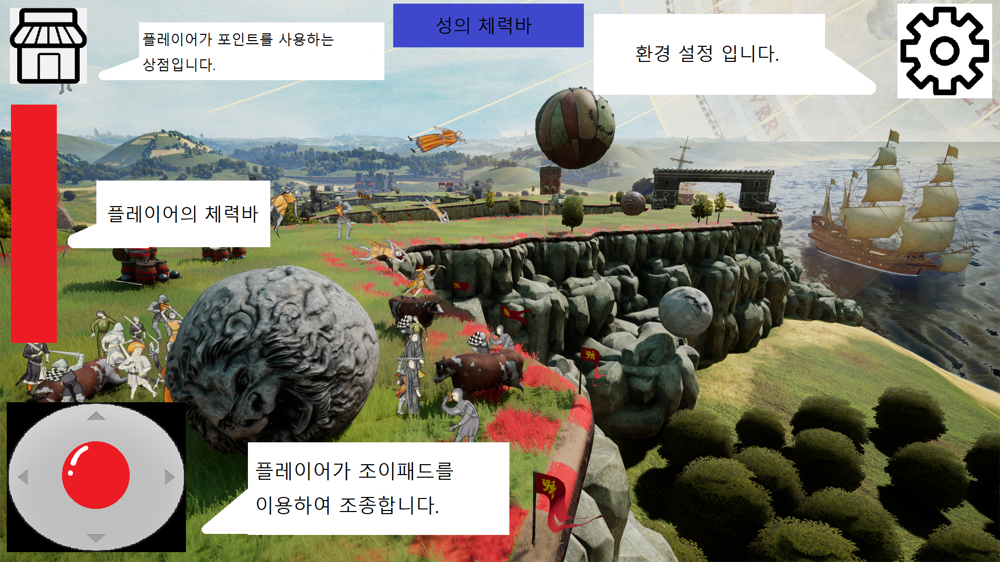

  

# [컨셉 & 대표이미지 기반 작품묘사] 

> ### 대표이미지 기반
-좌측 하단의 조이패드를 이용하여 플레이어가 바위를 조종할수있도록 합니다.

-좌측 중단에 플레이어의 체력바를 배치하여 외부로부터의 충격을 받으면 플레이어의 체력이 줄어들고 체력이 0 이 될시 플레이어가 파괴 됩니다.

-좌측 상단에 상점 아이콘을 배치하여 플레이어가 장애물을 파괴하여 얻은 포인트를 소모하여 플레이어의 바위를 강화 할수있습니다.

-중앙 상단에 성의 체력바를 배치하여 언제든지 플레이어가 성의 체력을 확인할수있도록 하였습니다.

-우측 상단에 환경설정을 배치하여 사운드 및 나가기등의 설정을 제공합니다

> ### 컨셉 기반 
- 플레이어가 바위가 되어 자연의 다른 바위들이 인간에 의해 강제적으로 건축물이 된것을 해방하는것을 목표로 합니다.

  

# [<롤링 락> 구성 요소] 

- 바위가 되어 건축물의 재료로 갇혀버린 바위들을 인간들로부터 해방시킨다.

 

## 1. 메커니즘

[도전 과제]

1. 적의 구조물을 파괴하여 성장하라
2. 적의 성벽에 도달해 적을 없애라

[재미 요소]

1. 플레이어가 바위가 되어 굴러간다는 색다른 경험
2. 여러 구조물들을 파괴하며 파괴의 희열감을 줌
3. 구조물을 파괴해가며 성장하는 플레이어

 

## 2. 이야기

[만들게 된 배경]  
락 오브 에이즈, 휴먼폴 플랫 같은 로우 폴리 모델링을 이용하여 게임의 사양을 낮춰 모바일에서도 사람들이 쉽게 접근할수있게 하고싶었습니다.

[카메라 관점]  
쿼터 뷰 카메라 관점

 

## 3. 미적요소

[디자인][컬러] 

 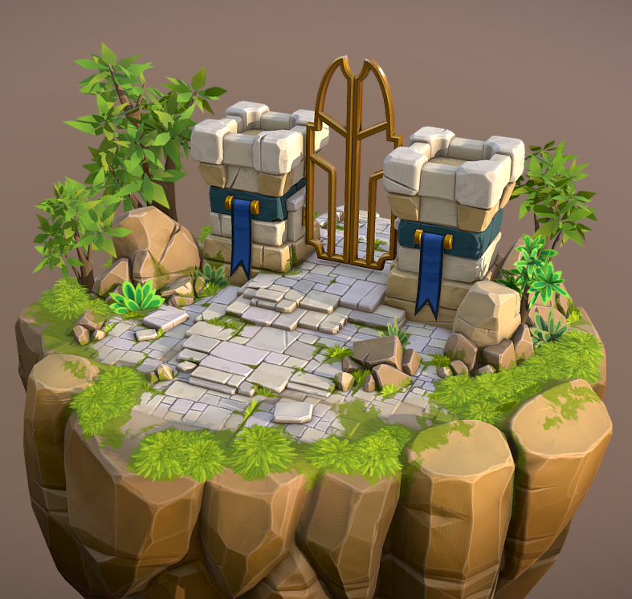 
 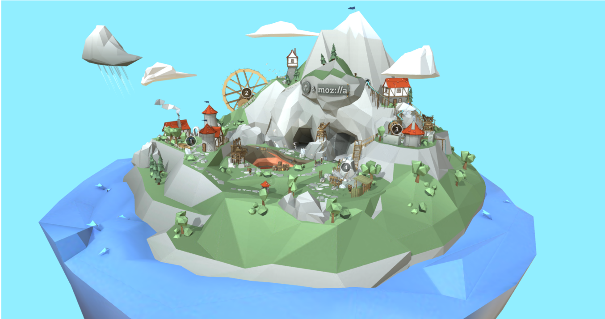

 모바일 환경에 맞춰 로우폴리의 캐주얼풍의 텍스쳐를 사용하며
 스테이지 별로 환경구성을 달리하여 제작

[음향]  
1. 플레이어 이동 시 굴러가는 음향
2. 오브젝트 파괴 시 파괴음
3. 오브젝트와 충돌 시 충돌음
4. 자연 컨셉에 맞는 배경음악
 

## 4. 기술

1. 모바일 환경을 고려한 LOW POLYGON모델링 제작
2. 모바일 환경에 맞는 해상도 설정

# [게임 시스템 디자인] 

## 1. 게임 오브젝트 분해 (구성요소 분석)
|연번|오브젝트 이름|오브젝트 이미지|
|:----:|:----:|:----:|
|1|바위(Rock),플레이어|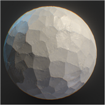|
|2|성문(Castle Gate)/승리조건|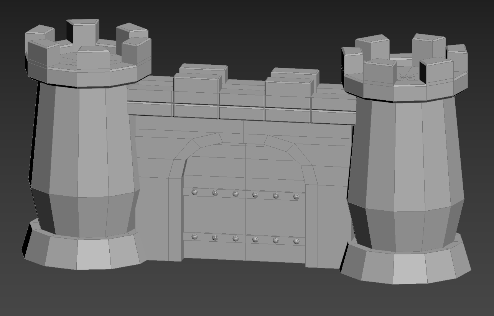|
|3|성벽(Rampart)|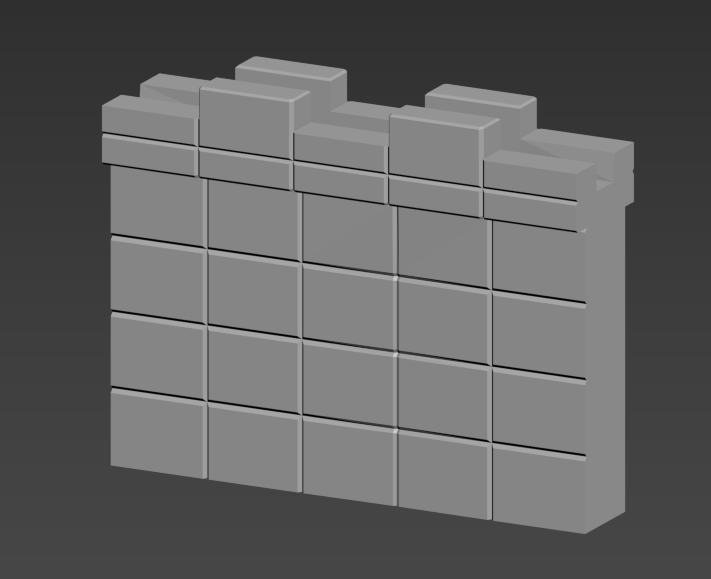|
|4|주민(Citizen)/적|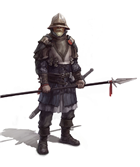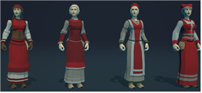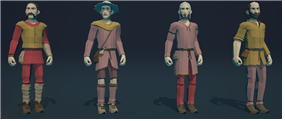|
|5|나무(Tree)|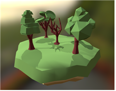|
|6|가시함정(Trap)|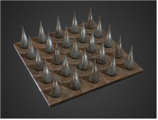|
|7|풍차(Windmill)|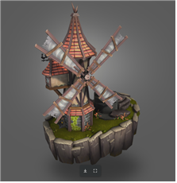|
|8|폭탄(Bomb)|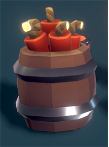|
|9|경사로(Slope)|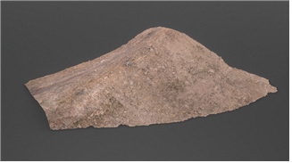|
|10|벙커(Bunker)|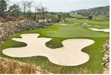|
|11|스테이지(Select Stage)|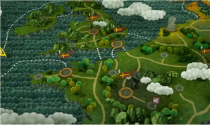|
|12|환경설정(Setting)||
|13|메뉴(Menu)|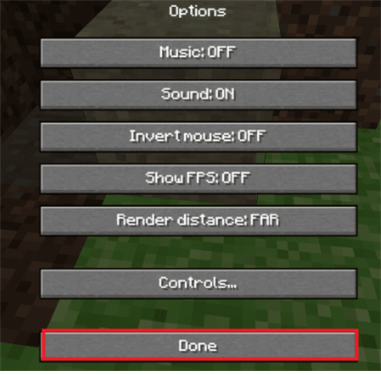|
|14|상점(Shop)|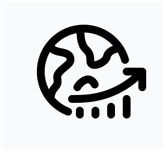|
|15|조이스틱(JoyStick)|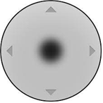|

## 2. 파라미터(속성) 뽑아보기

1)오브젝트 이름: 바위
|속성|영문명칭|설명|
|:----:|:----:|:----:|
|질량|Mass|바위의 질량, 질량이 높을수록 성문에 큰 데미지를 주고 성벽을 더 잘 부숨|
|가속|Acceleration|가속력, 플레이어가 원하는 방향으로 속도를 변환시켜주는 정도|
|최대 속력|Max Speed|플레이어가 움직이는 속도를 제한하는 속도|
|지름|Diameter|플레이어의 scale, 플레이어의 크기 조절|
|체력|Health|플레이어의 내구도, 체력이 0이 되면 플레이어가 파괴됨|
|재화|Stone Point|플레이어가 성벽을 파괴하게 되면 해당 포인트를 얻고 포인트를 이용하여 플레이어를 강화할 수 있다.|

2)오브젝트 이름: 성문
|속성|영문명칭|설명|
|:----:|:----:|:----:|
|체력|Health|체력이 0이되면 플레이어의 승리|

3)오브젝트 이름: 성벽
|속성|영문명칭|설명|
|:----:|:----:|:----:|
|체력|Health|체력이 0이되면 플레이어에게 재화를 준다|
|획득 재화량|Get Point|파괴되면 플레이어에게 재화를 준다|

4)오브젝트 이름: 주민
|속성|영문명칭|설명|
|:----:|:----:|:----:|
|무기|Weapon|플레이어에게 무기를 던져 플레이어의 접근을 막는다.|
|이동|Move|이동한다|
|정지|Stop|가만히 있는다.|

5)오브젝트 이름: 풍차
|속성|영문명칭|설명|
|:----:|:----:|:----:|
|바람세기|Power|바람의 세기를 조절한다.|
|바람모드|Mode|범위 내에 들어온 오브젝트에 가하는 AddForce의 Mode를 설정한다.|

6)오브젝트 이름: 폭탄
|속성|영문명칭|설명|
|:----:|:----:|:----:|
|바람세기|Power|바람의 세기를 조절한다.|
|바람모드|Mode|범위 내에 들어온 오브젝트에 가하는 AddForce의 Mode를 설정한다.|

## 3. 행동 뽑아 보기

1)오브젝트 이름: 바위
|행동|영문명칭|설명|
|:----:|:----:|:----:|
|이동|Move|플레이어를 이동시킨다|
|점프|Jump|튀어위로 오른다|

2)오브젝트 이름: 주민
|행동|영문명칭|설명|
|:----:|:----:|:----:|
|이동|Move|좌우로 이동한다|
|바위에 깔림|Crush|바위에 깔려 납작해진다|
|공격|Attack|바위를 공격한다|

## 4. 상태뽑아보기

1)오브젝트 이름: 바위
|현상태|전이상태|전이조건|
|:----:|:----:|:----:|
|이동|점프|점프키를 누름|

2)오브젝트 이름: 주민
|현상태|전이상태|전이조건|
|:----:|:----:|:----:|
|이동|바위에 깔림|플레이어에게 부딪혀 깔린 상태|
|이동|공격|플레이어가 일정 범위 내에 들어오면 공격|

## 5. 플레이어 캐릭터 속성(파라미터)

|속성|영문명칭|설명|
|:----:|:----:|:----:|
|바위|Rock|기본적인 바위|
|황금|Gold|체력이 약하지만 더 많은 재화를 얻을 수 있다|
|철|Steel|기본 바위보다 체력이 높고 단단하다|
|다이아|Diamond|철 바위보다 체력이 높고 단단하다|

# [FlowChat]

## 순서도
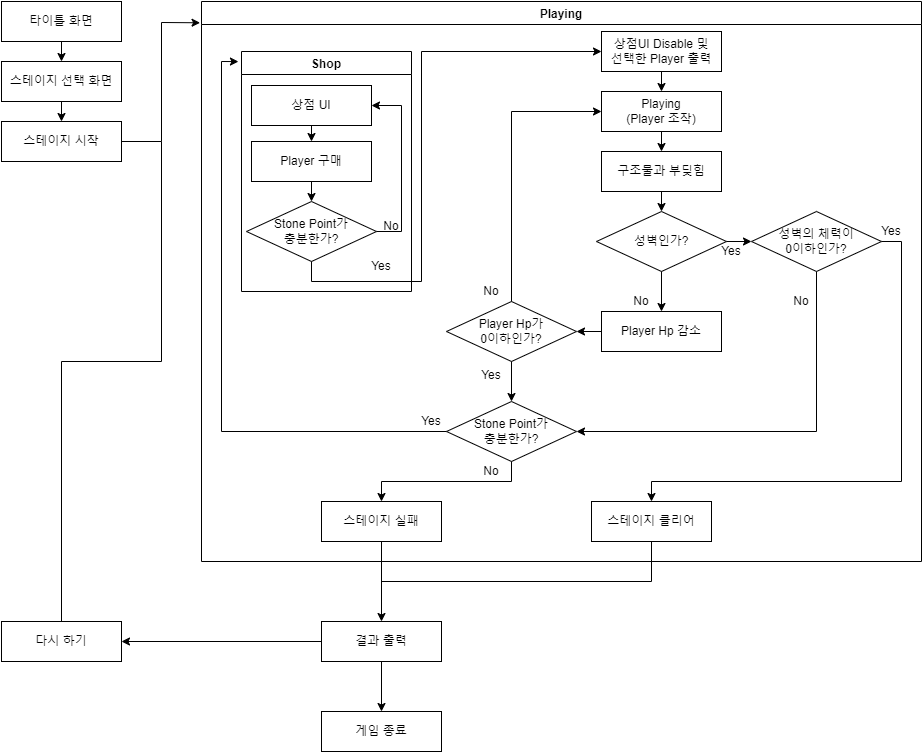

## 키 이벤트

# [요구사항]
### 1. 모델링 및 텍스쳐 제작
- 바위/플레이어
- 성벽
- 성문
- 주민/적
- 나무
- 가시함정
- 풍차
- 폭탄
- 맵

### 2. 모델링 바리에이션 제작
- 스테이지 컨셉에 따른 텍스쳐 바리에이션
- 건물 의 세부 장식 제작

### 3. 스테이지 제작 및 레벨링

### 4. UI 제작
 - 메인 메뉴 버튼
 - 상점 버튼 이미지
 - 조이스틱
 - 환경설정 이미지
 - 타이틀 화면
 - 스테이지 선택 화면
 - 승리/패배 화면
 - 포인트 이미지
 - 드래그 바

### 5. 오브젝트 파괴 애니메이션 제작
 - 바위/플레이어 파괴
 - 성벽 및 성문 파괴
 - 주민 사망 모션
 - 풍차 회전 모션

### 6. 프로그래밍 요구사항
 -게임 시작 및 한판이 끝날 때 fade in/out 효과
 -가상의 조이패드로 바위를 움직임
 -점프 버튼을 누르면 바위가 위로 뛰어오름
 -바위가 지면에 닿지 않는다면 1/10의 속도로 움직임
 -카메라가 플레이어의 뒤에서 플레이어를 따라다니며 플레이어를 비춤
 -적의 구조물을 파괴한다면 파괴하면서 지나가며 파괴하지 못하면 막힘
 -상점에서 플레이어 캐릭터 정하면 재화를 사용하여 구매하기
 -플레이어 HP가 0일때  재화가 부족하면 게임 실패
 -플레이어가 적의 성문을 부수면 게임 클리어
 -벽 투과하는 셰이더 제작

 -적의 구조물 파괴 시 재화획득 - 재화가 UI창으로 자동적으로 들어가는 것처럼 보이게
 -적의 구조물 파괴 시 구조물 조각내기
 -파괴된 구조물 조각 일정시간 뒤에 사라지게 하기
 
 -적 유닛 제작
 -적 공격 및 AI 제작

 -게임 승리/패배 시 조건에 맞는 게임화면 출력
 -게임 타이틀 화면 제작
 -상점UI제작
 -스테이지 화면 제작
 -설정창 제작
 -메뉴창 제작
