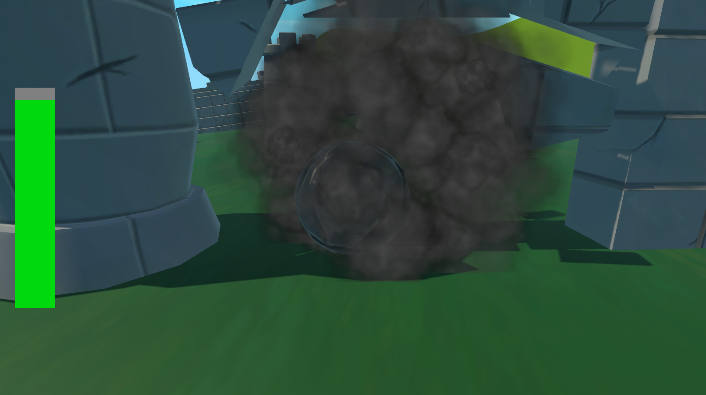
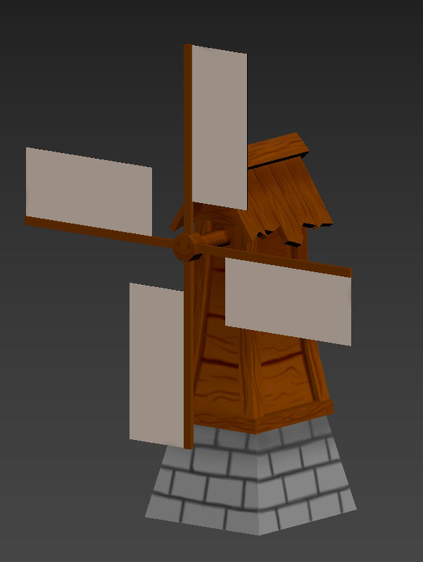
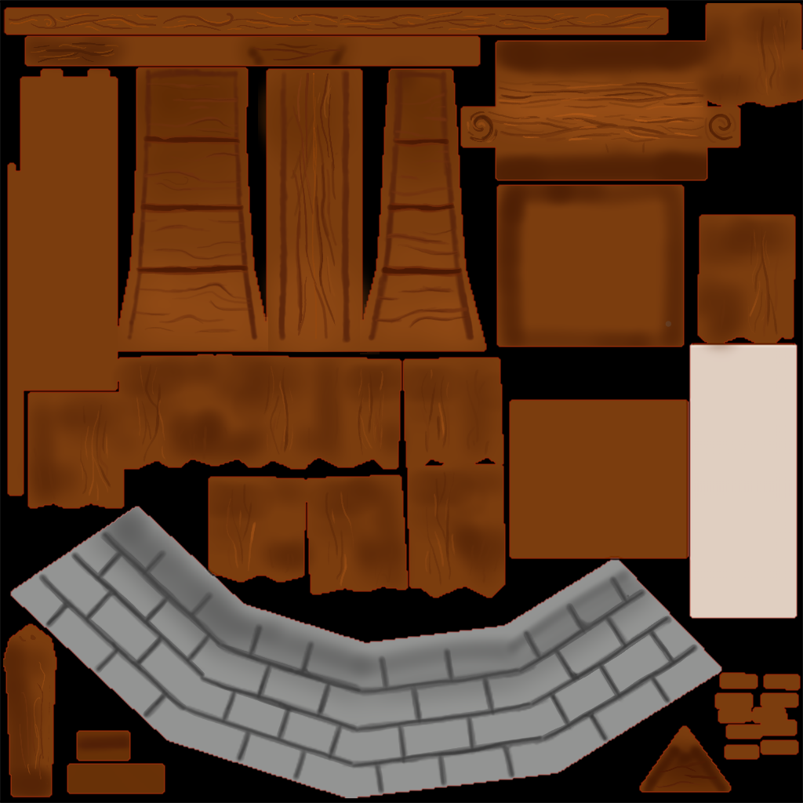
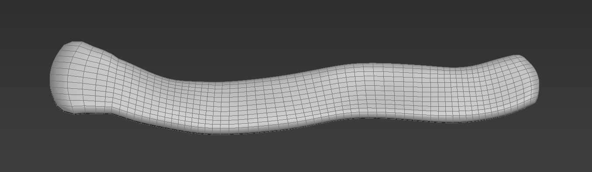

# 프로젝트명: Rollring Rock(정영범)

# [목차]

### 1. [컨셉](#컨셉)
### 2. [관련 이미지 & 동영상](#관련이미지)
### 3. [대표 이미지](#대표이미지)
### 4. [컨셉 & 대표이미지 기반 작품묘사](#작품묘사)
### 5. [롤링 락 구성 요소](#구성요소)
### 6. [게임 시스템 디자인](#시스템디자인)
### 7. [FlowChat](#FlowChat)
### 8. [요구사항](#요구사항)

# [컨셉] 

## 메인컨셉 :파괴

- 최종 목표인 성문이나 스테이지 내의 장애물들을 부수는 것으로 희열감을 얻을 수 있다.

### 서브 컵셉 1 :장애물

- 스피드만 빠르게 되면 자칫 루즈해질 수 있는 게임에 장애물이라는 긴장감을 주어

	플레이어로 하여금 높은 몰입감을 주기 위해 장애물을 넣는다.

### 서브 컵셉 2 :스피드

- 빠른 스피드를 통해 플레이어로 하여금 몰입감과 쾌감을 선사한다.

### 서브 컵셉 3 :연속성

- 스테이지를 클리어하거나 리셋하기 전까지는 한 스테이지 내에서 플레이어가 플레이한 내용이

	다음 플레이에도 영향을 주는 연속성을 주어 다양한 전략을 낼 수 있도록 유도한다.

  

# [관련 이미지 & 동영상] 

- 이미지  
  
- 동영상
  

  

# [대표 이미지] 

  

# [컨셉 & 대표이미지 기반 작품묘사] 

> ### 대표이미지 기반
- 키보드의 wasd를 통해 플레이어 조작
- 플레이어의 HP가 0이 되거나 밖으로 떨어질시 플레이어 사망
- 성에 도달하여 성문파괴 시 스테이지 클리어
> ### 컨셉 기반 
- 플레이어가 바위가 되어 자연의 다른 바위들이 인간에 의해 강제적으로 건축물이 된것을 해방하는것을 목표로 합니다.

  

# [롤링 락 구성 요소] 

 

## 1. 메커니즘

[도전 과제]

- 적의 구조물을 파괴하여 성장하라

[재미 요소]

- 여러 구조물들을 파괴하는 파고의 희열감
- 어려운 조잦ㄱ 난이도를 통한 컨트롤의 재미

 

## 2. 이야기

[만들게 된 배경]  
- 바위가 구조물들을 파괴하며 건물을 파괴하며 스트레스를 해소할수있음
- 어려운 조작법을 기반으로 플레이어 승부욕이나 분노하는 모습을 볼수있음

[카메라 관점]  
- 플레어를 따라다니며 3인친으로 비춤
- 카메라를 위아래로 움직이면 카메라가 따라서 위아래로 움직임

 

## 3. 미적요소

[디자인][컬러] 

  
 

 모바일 환경에 맞춰 로우폴리의 캐주얼풍의 텍스쳐를 사용하며
 스테이지 별로 환경구성을 달리하여 제작

[음향]  
1. 플레이어 이동 시 굴러가는 음향
2. 오브젝트 파괴 시 파괴음
3. 오브젝트와 충돌 시 충돌음
4. 자연 컨셉에 맞는 배경음악
5. 폭탄 폭파시 
 

## 4. 기술

1. 모바일 환경을 고려한 LOW POLYGON모델링 제작
2. 모바일 환경에 맞는 해상도 설정
3. 3D MAX 를 이용한 모델링 및 애니메니션 제작
4. 포토샵을 이용한 UI 제작
5. 포토샵과 3D 페인터를 이용한 텍스쳐 제작

# [게임 시스템 디자인] 

## 1. 게임 오브젝트 분해 (구성요소 분석)

|연번|오브젝트 이름|오브젝트 이미지|
|:----:|:----:|:----:|
|1|바위(Rock),플레이어||
|2|성문(Castle Gate)||
|3|성벽(Rampart)||
|4|새집(Bird House)||
|5|나무(Tree)||
|6|가시함정(Trap)||
|7|풍차(Windmill)||
|8|폭탄(Bomb)||
|9|경사로(Slope)||
|10|황금 새(Gold Bird)||
|11|스테이지(Select Stage)||
|12|환경설정(Setting)||
|13|메뉴(Menu)||
|14|풍차||

## 2. 파라미터(속성) 뽑아보기

1)오브젝트 이름: 바위

|속성|영문명칭|설명|
|:----:|:----:|:----:|
|질량|Mass|바위의 질량, 질량이 높을수록 성문에 큰 데미지를 주고 성벽을 더 잘 부숨|
|가속|Acceleration|가속력, 플레이어가 원하는 방향으로 속도를 변환시켜주는 정도|
|최대 속력|Max Speed|플레이어가 움직이는 속도를 제한하는 속도|
|지름|Diameter|플레이어의 scale, 플레이어의 크기 조절|
|체력|Health|플레이어의 내구도, 체력이 0이 되면 플레이어가 파괴됨|
|재화|Stone Point|플레이어가 성벽을 파괴하게 되면 해당 포인트를 얻고 포인트를 이용하여 플레이어를 강화할 수 있다.|

2)오브젝트 이름: 성문

|속성|영문명칭|설명|
|:----:|:----:|:----:|
|체력|Health|체력이 0이되면 플레이어의 승리|

3)오브젝트 이름: 성벽

|속성|영문명칭|설명|
|:----:|:----:|:----:|
|체력|Health|체력이 0이되면 플레이어에게 재화를 준다|
|획득 재화량|Get Point|파괴되면 플레이어에게 재화를 준다|

4)오브젝트 이름: 주민

|속성|영문명칭|설명|
|:----:|:----:|:----:|
|무기|Weapon|플레이어에게 무기를 던져 플레이어의 접근을 막는다.|
|이동|Move|이동한다|
|정지|Stop|가만히 있는다.|

5)오브젝트 이름: 풍차

|속성|영문명칭|설명|
|:----:|:----:|:----:|
|바람세기|Power|바람의 세기를 조절한다.|
|바람모드|Mode|범위 내에 들어온 오브젝트에 가하는 AddForce의 Mode를 설정한다.|

6)오브젝트 이름: 폭탄

|속성|영문명칭|설명|
|:----:|:----:|:----:|
|폭발 위력|Power|폭발의 강도를 설정한다.|
|폭발 범위|Rage|폭발의 범위를 설정한다.|

## 3. 행동 뽑아 보기

1)오브젝트 이름: 바위

|행동|영문명칭|설명|
|:----:|:----:|:----:|
|이동|Move|플레이어를 이동시킨다|
|점프|Jump|튀어위로 오른다|

2)오브젝트 이름: 주민

|행동|영문명칭|설명|
|:----:|:----:|:----:|
|이동|Move|좌우로 이동한다|
|바위에 깔림|Crush|바위에 깔려 납작해진다|
|공격|Attack|바위를 공격한다|

## 4. 상태뽑아보기

1)오브젝트 이름: 바위

|현상태|전이상태|전이조건|
|:----:|:----:|:----:|
|이동|점프|점프키를 누름|

2)오브젝트 이름: 주민

|현상태|전이상태|전이조건|
|:----:|:----:|:----:|
|이동|바위에 깔림|플레이어에게 부딪혀 깔린 상태|
|이동|공격|플레이어가 일정 범위 내에 들어오면 공격|

# [FlowChat]

## 순서도

## 키 이벤트

# [요구사항]
### 1. 모델링 및 텍스쳐 제작

1. ~~폭탄~~
2. ~~성벽~~
3. ~~성채~~
4. ~~성문~~
5. ~~맵 배치용 바위~~
6. ~~나무~~
7. ~~가시함정~~
8. ~~풍차~~
9. ~~바위/플레이어~~
10. ~~맵~~
11. ~~새~~
12. ~~스테이지 백그라운드~~

### 2. 건물 잔해 모델링 및 텍스쳐 제작

1. ~~성벽~~
2. ~~성채~~
3. ~~성문~~
4. ~~풍차~~
5. ~~가시함정~~

### 3. UI 제작

 1. ~~메인 메뉴 버튼~~
 2. ~~스테이지 선택 버튼~~
 3. ~~환경설정 이미지~~
 4. ~~스테이지 선택 화면~~
 5. ~~hp 바~~

### 4. 1챕터 스테이지 제작 및 레벨링

1. ~~스테이지 1 제작 및 오브젝트 ~~
2. ~~스테이지 2 제작 및 오브젝트 ~~
3. ~~스테이지 3 제작 및 오브젝트 ~~

### 5. 포스터 제작

## [프로그래밍 요구사항]

- ~~fade in/out 효과~~
- ~~플레이어가 적의 성문을 부수면 게임 클리어~~
- ~~적의 구조물을 파괴한다면 파괴하면서 지나가며 파괴하지 못하면 막힘~~
- ~~플레이어의 HP가 0이 되면 초기위치로 돌아감~~
- ~~플레이어가 스테이지 이탈 시 초기위치로 돌아감~~
- ~~스테이지 클리어시 해금~~
- ~~게임 진행사항 저장~~
- ~~wasd를 눌러서 바위를 움직임~~
- ~~점프 버튼을 누르면 바위가 뛰어오름~~
- ~~카메라가 플레이어의 뒤에서 플레이어를 따라다니며 플레이어를 보여줌~~
- ~~마우스의 움직임으로 카메라를 제어할 수 있음~~
- ~~적의 구조물 파괴 시 구조물 조각내기~~
- ~~파괴된 구조물 조각 사라지게 하기~~
- ~~폭탄 접촉 시 폭탄 파괴 및 폭발 생성~~
- ~~구조물 파괴 시 파괴 효과(파티클)생성~~
- ~~풍차의 바람영역에 있으면 바람에 밀림~~
- ~~가시함정 접촉 시 플레이어 데미지 입음~~

## [모델링 및 텍스쳐이미지]

### 성벽

### 성채

### 폭탄

### 나무

### 성문

### 풍차

### 스테이지

### 함정

### 플레이어/바위

### 맵배치용 바위

### 새

### 스테이지 백그라운드

### UI

